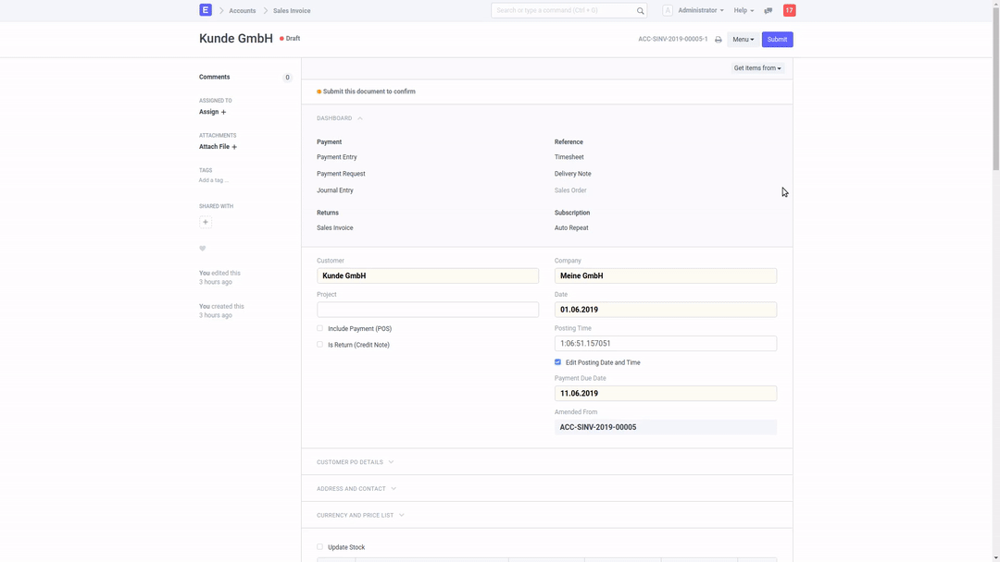

## PDF on Submit

Generate a PDF on submit of Quotation, Sales Order, Sales Invoice, Delivery Note or [Dunning](https://github.com/alyf-de/dunning).
All can be turned off via `PDF on Submit Settings`.

If "Create PDF in Background" is enabled, you can continue to work on other documents immediately, even if you submit in bulk. The PDFs will just appear when they are created. This might require a reload of the current document.

If "Create PDF in Background" is disabled, you will see a progress bar and the system will be blocked until the PDF is created. This might take some time for bulk submissions.



### Install

```bash
cd frappe-bench
bench get-app https://github.com/alyf-de/pdf_on_submit.git
bench --site erp.my-company.com install-app pdf_on_submit
```

(Replace `erp.my-company.com` with your site name.)

For some reason, the `on_submit` trigger still runs before submission is complete. That's why there will be **DRAFT** printed on your documents. If you do not want this, got to Print Settings and uncheck `Always add "Draft" Heading for printing draft documents`.

#### License

Copyright (C) 2019  Raffael Meyer <raffael@alyf.de>

This program is free software: you can redistribute it and/or modify
it under the terms of the GNU General Public License as published by
the Free Software Foundation, either version 3 of the License, or
(at your option) any later version.

This program is distributed in the hope that it will be useful,
but WITHOUT ANY WARRANTY; without even the implied warranty of
MERCHANTABILITY or FITNESS FOR A PARTICULAR PURPOSE.  See the
GNU General Public License for more details.

You should have received a copy of the GNU General Public License
along with this program.  If not, see <https://www.gnu.org/licenses/>.
