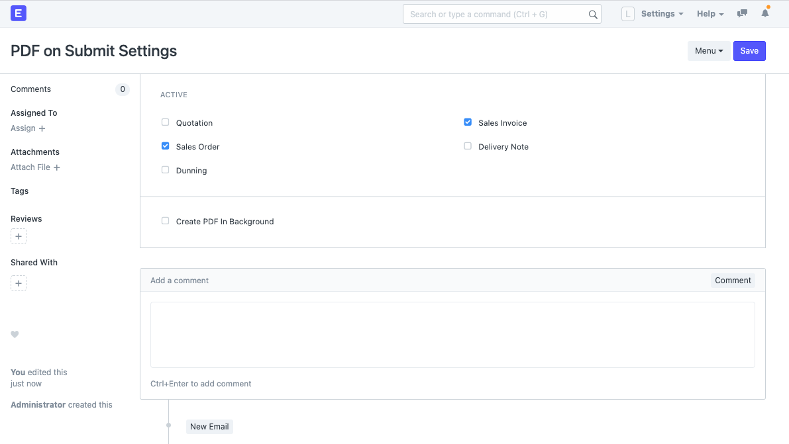

# PDF on Submit

Automatically generates and attaches a PDF when a sales document gets submitted. Works for **Quotation**, **Sales Order**, **Sales Invoice**, **Delivery Note** and **Dunning**.


## Install on Frappe Cloud

1. Go to https://frappecloud.com/dashboard/#/sites and click the "New Site" button.
2. In Step 2 ("Select apps to install"), select "PDF on Submit".
3. Complete the new site wizard.

## Install on Self-Hosted

```bash
cd frappe-bench
bench get-app https://github.com/alyf-de/pdf_on_submit.git
bench --site MY_SITE install-app pdf_on_submit
```

> Remeber to replace `MY_SITE` with your site name.

## Settings

To change the settings of this app, you can open **PDF on Submit Settings** via the search bar.

- Choose active DocTypes

  Here you can select for which DocTypes this app is active. DocTypes that are disabled will be ignored.

- Create PDF in Background

    Enable this option if you want to continue your work immediately. The PDFs will just appear once they are created. (This might require a reload of the current document.) Recommended if you usually submit many sales documents in bulk.
    
    Disable this option to get the PDF immediately. When you submit the document you will see a progress bar while the PDF gets created. When it's done you immediately see the PDF attached to the document.



This app uses the Default Print Format. To change the Default Print Format,

1. Open the list view of a supported DocType,
2. Go to Menu > Customize,
3. In section "View Settings", select a Default Print Format.

The PDF will be created in the language that is specified in the "Language" field of the current document. In your **Customer** and **Supplier** masters you can choose the default "Print Language".

## Licence

Copyright (C) 2020  ALYF GmbH <hallo@alyf.de>

This program is free software: you can redistribute it and/or modify
it under the terms of the GNU General Public License as published by
the Free Software Foundation, either version 3 of the License, or
(at your option) any later version.

This program is distributed in the hope that it will be useful,
but WITHOUT ANY WARRANTY; without even the implied warranty of
MERCHANTABILITY or FITNESS FOR A PARTICULAR PURPOSE.  See the
GNU General Public License for more details.

You should have received a copy of the GNU General Public License
along with this program.  If not, see <https://www.gnu.org/licenses/>.
